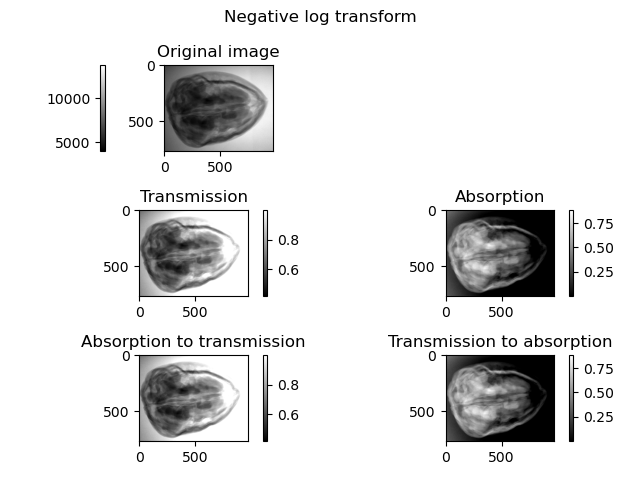

# Homework 1

## Part 3: Preprocessing for computed tomography

I'll start by implementing these functions as a simple function inside some files, maybe in the future it may be sensible to move them inside some sort of package. The tests are implemented in the `hw01.py` file.

### i) Flat-field correction

I implemented this function in the `FlatFieldCorrection.py` file. To test this functionality, I used some data from [this](https://zenodo.org/record/2686726) dataset. I selected a few frames just to give a brief demonstration. If I understand correctly the files `di000000.tif` and `io000000.tif` are the **dark frame** and **flat field** respectively. The results seems satisfying.

### ii) Transmission to Absorption conversion

I implemented these functions inside the `NegativeLogTransform.py` file. Compared to the instructions, I decided to name the functions `transmissionToAbsorption` and `absorptionToTransmission` to keep some kind of naming consistency with the previous task. According to "Computed Tomography: Algorithms, Insight, and Just Enough Theory", by Per Christian Hansen, Jakob Sauer Jørgensen, and William R. B. Lionheart (2021), the **transmission image** is the ratio between the *measured intensity* $I_1$ and the *initial intensity* of the X-ray beam $I_0$. Given that $I_0$ is not known precisely, I considered the average of the maximum value along each row. To find this value, I implemented a function `findI0`. I then implemented the functions `getTransmission` and `getAbsorption` to calculate these two images from $I_0$ and the initial measured image, and `transmissionToAbsorption` and `absorptionToTransmission` to switch between the two. The relationships between these elements are summarized in the following table:

| image = $I_1$  |initial intensity = $I_0$   |
|:---: |:---: |
| tansmission = $T$ = $\frac{I_1}{I_0}$ | absorption = $A$ = $-\log\frac{I_1}{I_0}$  |
| $T$=$e^{-A}$  | $A$=$-\log{T}$   |

### iii) Cleaning the signal

I included this task inside the implementation of the previous point. I decided to preprocess the data in both `getTransmission` and `getAbsorption` functions. In both cases I checked if the pixel value is above $I_0$ and in that case I set it to $I_0$. I tested the functions on an image from the dataset specified in point i).

### iv) Binning

I implemented this tool in the `Binning.py` file and tested it in `hw01.py`, firstly on some random arrays because the result is more visible and then on an image from the same dataset as point i). The image looks the same, but we can see from the axis labels that the image is now half the size.

### v) Center of rotation correction

I implemented this function in the `CenterOfRotationCorrection.py` file. I tested it on the same image as point iv) and it seems to work fine.

### vi) Padding

I used the same image to demonstrate the padding functionality. I implemented this function in the `Padding.py` file. I decided to code the horizontal and vertical padding separately, so that the user can choose to pad only one of the two dimensions.

N.B. the color seems "faded" compared to the previous images due to the rescaling that happens when we add a lot of zero values. Maybe it would be more visually uniform if we padded with the minimum found in the image instead of zero.

