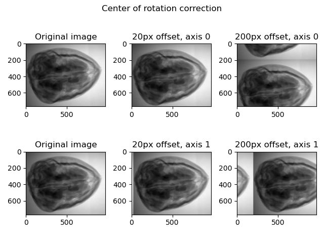

# Homework 1

## Part 3: Preprocessing for computed tomography

I'll start by implementing these functions as a simple function inside some files, maybe in the future it may be sensible to move them inside some sort of package. The tests are implemented in the `hw01.py` file.

### i) Flat-field correction

I implemented this function in the `FlatFieldCorrection.py` file. To test this functionality, I used some data from [this](https://zenodo.org/record/2686726) dataset. I selected a few frames just to give a brief demonstration. If I understand correctly the files `di000000.tif` and `io000000.tif` are the **dark frame** and **flat field** respectively. The results seems satisfying.

### ii) Transmission to Absorption conversion

I implemented this functions inside the `NegativeLogTransform.py` file. Compared to the instructions, I decided to name the functions `transmissionToAbsorption` and `absorptionToTransmission` to keep some kind of naming consistency with the previous task.

### iii) Cleaning the signal

I included this task inside the implementation of the previous point. I decided to preprocess the data in both `transmissionToAbsorption` and `absorptionToTransmission` functions. For the **transmission image**, that is, checking if the pixel value is above $I_0$ and in that case setting it to $I_0$; for the **absorption image**, that is, checking if the pixel value is below 0 and in that case setting it to 0.

### iv) Binning

I implemented this tool in the `Binning.py` file and tested it in `hw01.py`, firstly on some random arrays because the result is more visible and then on an image from the same dataset as point i). The image looks the same, but we can see from the axis labels that the image is now half the size.

### v) Center of rotation correction

I implemented this function in the `CenterOfRotationCorrection.py` file. I tested it on the same image as point iv) and it seems to work fine.

