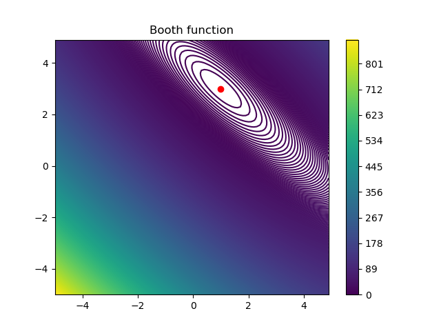
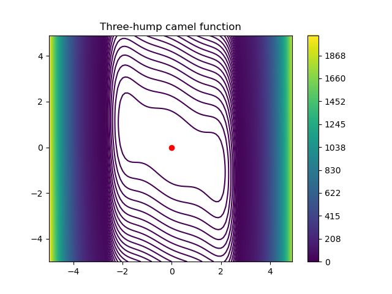

# Homework 2

For this homework I'm using the [Cone-Beam Computed Tomography Dataset of a Seashell](https://zenodo.org/record/6983008), that I saved on the available remote machine in `/srv/ceph/share-all/aomip/6983008_seashell`. Given that the documentation says that the image should be moved 4px to the left for best results, I perform this operation when opening the files.

I show just a small sample out of the dataset, with 4px correction and binning applied 3 times.

## Part 1: Preprocessing again

I implemented this function in the file `Slicing.py`. It takes a collection of projections and extracts the requested line, stacking each line vertically in order to create a sinogram.

I tried with different rows and the results seem satisfying.

## Part 2: Iterative reconstruction

I implemented gradient descent in the file `GradientDescent.py`. It takes the gradient of the function and as optional parameters $\lambda$, the maximum number of iterations and the tolerance. I tested on a couple of test functions selected from Wikipedia's [Test functions for optimization](https://en.wikipedia.org/wiki/Test_functions_for_optimization).

#### Booth function

$$ f(x,y)=(x+2y-7)^2+(2x+y-5)^2$$
$$\nabla f(x,y)=[10x+8y-34,\quad 8x+10y-38]$$

I highlighted the point of minimum, that is $(1,3)$.

With starting point $(-5,-5)$, this is the performance when changing $\lambda$:

| $\lambda$  | $x$  | Number of iterations |
|:---:|:---:|:---:|
| $10^0$  | $(-5049644257955834245, -5049644257955834245)$  | $1000$ |
| $10^{-1}$  | $(0.99999974, 2.99999965)$  | $76$ |
| $10^{-2}$  | $(1.0000342, 2.9999658)$  | $509$ |
| $10^{-3}$  | $(1.13506443, 2.86493539)$  | $1000$ |
| $10^{-4}$  | $(0.66349738, 1.02606863)$  | $1000$ |

We can easily see that with $\lambda=1$, the algorithm overshoots. With smaller values, the results are more satisfying. We see however that the optimal value for this case is $\lambda=10^{-1}$, that reaches the default tolerance $(10^{-6})$ in only $76$ iterations. We also notice that with $\lambda=10^{-4}$ we're still a bit far from the correct result, probably because the convergence is too slow.

#### Three-hump camel function

$$f(x,y)=2x^2-1.05x^4+\frac{x^6}{6}+xy+y^2$$
$$\nabla f(x,y)=[4x-4.2x^3+x^5+y, \quad x+2y]$$

I highlighted the point of minimum, that is $(0,0)$.

With starting point $(-5,-5)$, this is the performance when changing $\lambda$:

| $\lambda$  | $x$  | Number of iterations |
|:---:|:---:|:---:|
| $10^0$  | $(\text{nan}, \inf)$  | $5$ |
| $10^{-1}$  | $(\text{nan}, 2.2205799\cdot10^{269})$  | $5$ |
| $10^{-2}$  | $(\text{nan}, 6.50483625\cdot10^{101})$  | $5$ |
| $10^{-3}$  | $(0.00024084, -0.00058143)$  | $5318$ |
| $10^{-4}$  | $(0.00241247, -0.00582463)$  | $38350$ |

This time, I had to increase the maximum number of iterations in order to see something interesting. The method is still capable of finding the minimum, but compared to the previous test function has an even higher risk of overshooting and the overall convergence is slower.
