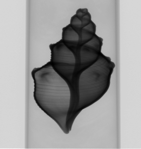

# Homework 2

For this homework I'm using the [Cone-Beam Computed Tomography Dataset of a Seashell](https://zenodo.org/record/6983008), that I saved on the available remote machine in `/srv/ceph/share-all/aomip/6983008_seashell`. Given that the documentation says that the image should be moved 4px to the left for best results, I perform this operation when opening the files.

I show just a small sample out of the dataset, with 4px correction and binning applied 3 times.

## Part 1: Preprocessing again

I implemented this function in the file `Slicing.py`. It takes a collection of projections and extracts the requested line, stacking each line vertically in order to create a sinogram.

I tried with different rows and the results seem satisfying.

