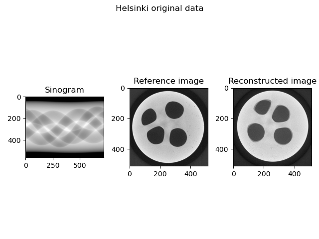
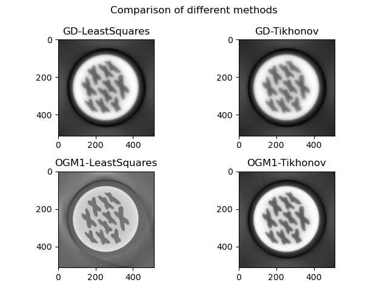
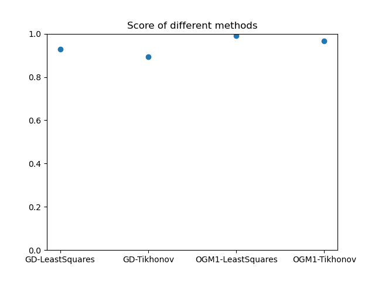
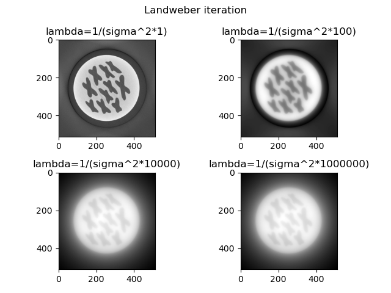
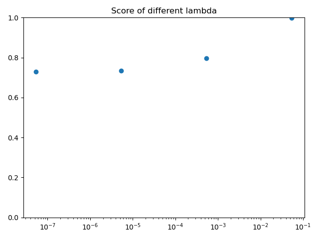

# Homework 3

In order to improve ease of use, I decided to refactor `GradientDescent.py` in an object oriented way. I kept as reference the old version and implemented the new one in `GradientDescentClass.py`.

## Part 1: More gradient based methods

### i) Nesterov's Methods

I followed the same principle as the new `GradientDescentClass.py` file and implemented OGM1 as a class. As an initial image value, I use a completely black one and then I try to apply Gradient Descent and Optimized Gradient Method to the classical least squares problem and the one with L2-regularization.

As we can see, the score is pretty good with all the methods, with the best correlation obtained with OGM1 and least squares problem. Probably with more fine tuning in the parameters we can achieve great results with all the methods.

| Method  | Score  |
|:-:|:-:|
| Gradient descent, least squares  | 0.9293 |
| Gradient descent, Tikhonov  | 0.8939 |
| Optimized gradient method, least squares  | 0.9896 |
| Optimized gradient method, Tikhonov  | 0.9676 |

### ii) Landweber iteration

Following the spirit of the other mehods, I implement the Landweber iteration in a object oriented fashion as well. Given that $0<\lambda<\frac{2}{\sigma_1^2}$, I decide to test with fractions of $\frac{2}{\sigma_1^2}$.

| $\lambda$  | Score  |
|:-:|:-:|
| $\frac{1}{\sigma_1^2}$  | 0.9984 |
| $\frac{1}{\sigma_1^2\cdot10^2}$  | 0.7970 |
| $\frac{1}{\sigma_1^2\cdot10^4}$  | 0.7331 |
| $\frac{1}{\sigma_1^2\cdot10^6}$  | 0.7298 |

We can see that compared to the other methods, here we actually see a better result with a $\lambda$ in the higher end of the interval. This looks like a promising result, because it means that for each step we move more forward.

The result with $\lambda=\frac{1}{\sigma_1^2}$ seems extremely interesting.