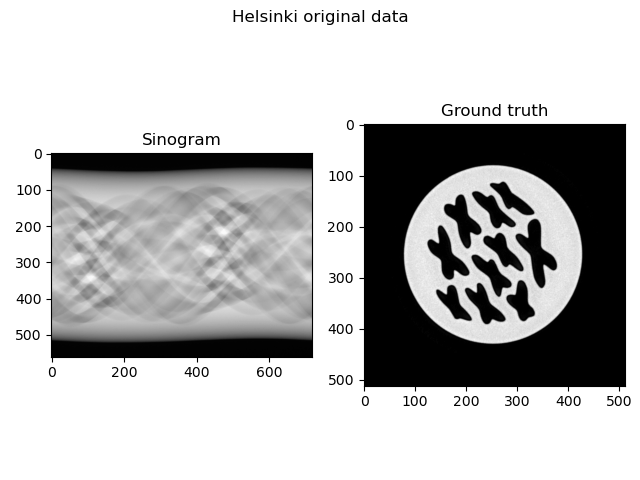
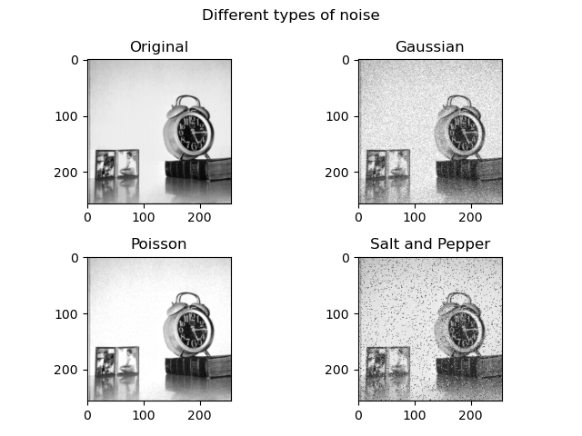

# Homework 3

In order to improve ease of use, I decided to refactor `GradientDescent.py` in an object oriented way. I kept as reference the old version and implemented the new one in `GradientDescentClass.py`.

## Part 1: More gradient based methods

### i) Nesterov's Methods

I followed the same principle as the new `GradientDescentClass.py` file and implemented OGM1 as a class. As an initial image value, I use a completely black one and then I try to apply Gradient Descent and Optimized Gradient Method to the classical least squares problem and the one with L2-regularization.

As we can see, the score is pretty good with all the methods, with the best correlation obtained with OGM1 and least squares problem. Probably with more fine tuning in the parameters we can achieve great results with all the methods.

| Method  | Score  |
|:-:|:-:|
| Gradient descent, least squares  | 0.9293 |
| Gradient descent, Tikhonov  | 0.8939 |
| Optimized gradient method, least squares  | 0.9896 |
| Optimized gradient method, Tikhonov  | 0.9676 |

### ii) Landweber iteration

Following the spirit of the other mehods, I implement the Landweber iteration in a object oriented fashion as well. Given that $0<\lambda<\frac{2}{\sigma_1^2}$, I decide to test with fractions of $\frac{2}{\sigma_1^2}$.

| $\lambda$  | Score  |
|:-:|:-:|
| $\frac{1}{\sigma_1^2}$  | 0.9984 |
| $\frac{1}{\sigma_1^2\cdot10^2}$  | 0.7970 |
| $\frac{1}{\sigma_1^2\cdot10^4}$  | 0.7331 |
| $\frac{1}{\sigma_1^2\cdot10^6}$  | 0.7298 |

We can see that compared to the other methods, here we actually see a better result with a $\lambda$ in the higher end of the interval. This looks like a promising result, because it means that for each step we move more forward.

The result with $\lambda=\frac{1}{\sigma_1^2}$ seems extremely interesting.

### iv) Conjugate gradient

I found out that the method is indeed faster than the others: the best result is achieved with just one iteration, but the score is lower compared to the other methods: probably it would be useful as a cheap good approximation to use as a starting point for other, more accurate methods.

| `nmax` for CGD  | Score  |
|:-:|:-:|
| 1  | 0.7339 |
| 5  | 0.0043 |
| 10  | 0.0015 |
| 100  | 0.0015 |

| Method  | Score  |
|:-:|:-:|
| Gradient descent  | 0.9293 |
| Optimized gradient method  | 0.9896 |
| Landweber  | 0.9984 |
| Conjugate gradient descent  | 0.7339 |

## Part 2: Solving problems other than X-ray CT

### Denoising

I decided to pick the *Clock* image from the [University of Southern California's database](https://sipi.usc.edu/database/database.php?volume=misc) in order to try and apply the three different types of noise. These are implemented in the file `Noise.py` as a class.

In order to denoise the image, some kind of regularisation is needed, like Tikhonov. With a Tikhonov problem, from the formulation $\frac{1}{2}||Ax-b||_2^2+\frac{\beta}{2}||x||_2^2$, with $A$ equal to the identity matrix, we obtain as a derivative $(x-b)+\beta x$. However, when solving it through Gradient Descent, with different values of $\beta$ and $\lambda$, we don't achieve satisfying results. These are the results with $10^7$ iterations and default $\lambda$.

#### Gaussian noise

**Relative error compare to ground truth: 0.121**

| $\beta$  | Relative error  |
|:-:|:-:|
| $10^{-2}$  | 0.120 |
| $10^{-3}$  | 0.121 |
| $10^{-4}$  | 0.121 |
| $10^{-5}$  | 0.121 |

#### Poisson noise

**Relative error compare to ground truth: 0.126**

| $\beta$  | Relative error  |
|:-:|:-:|
| $10^{-2}$  | 0.116 |
| $10^{-3}$  | 0.125 |
| $10^{-4}$  | 0.126 |
| $10^{-5}$  | 0.126 |

#### Salt and Pepper noise

**Relative error compare to ground truth: 0.127**

| $\beta$  | Relative error  |
|:-:|:-:|
| $10^{-2}$  | 0.210 |
| $10^{-3}$  | 0.210 |
| $10^{-4}$  | 0.210 |
| $10^{-5}$  | 0.210 |

I print show two of the best results for comparison:

