# Homework 4

## Part 1: Even more gradient based methods

### i) Choosing the correct step length

I modify the `GradientDescentClass.py` in order to include these two line search algorithms through some boolean flags. For testing, I re-use the same test functions I used in *Homework 2*, selected from Wikipedia's [Test functions for optimization](https://en.wikipedia.org/wiki/Test_functions_for_optimization). I directly confront backtracking, BB1 and BB2 at the same time.

#### Booth function

$$ f(x,y)=(x+2y-7)^2+(2x+y-5)^2$$
$$\nabla f(x,y)=[10x+8y-34,\quad 8x+10y-38]$$

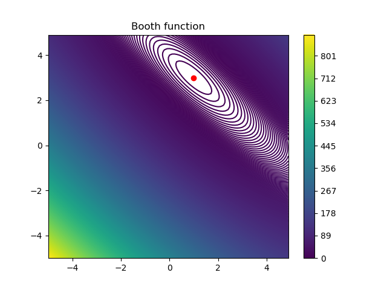

I highlighted the point of minimum, that is $(1,3)$.

With starting point $(-5,-5)$, this is the performance for different line search algorithms:

| Algorithm  | $x$  | Number of iterations | Absolute error |
|:---:|:---:|:---:|:---:|
| Backtracking  | $(1.00000267, 2.99999745)$  | $36$ | $3.6911\cdot10^{-6}$ |
| Barzilai and Borwein 1  | $(1., 3.)$  | $8$ | $6.2804\cdot10^{-16}$ |
| Barzilai and Borwein 2  | $(1., 3.)$  | $8$ | $1.1102\cdot10^{-16}$ |

We can see that in particular BB1 and BB2 achieve a great result, with machine precision and a very low number of iterations.

#### Three-hump camel function

$$f(x,y)=2x^2-1.05x^4+\frac{x^6}{6}+xy+y^2$$
$$\nabla f(x,y)=[4x-4.2x^3+x^5+y, \quad x+2y]$$

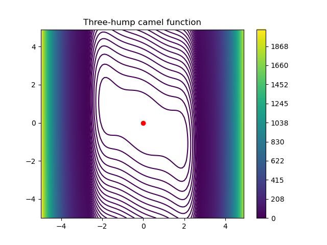

I highlighted the point of minimum, that is $(0,0)$.

With starting point $(-5,-5)$, this is the performance for different line search algorithms:

| Algorithm  | $x$  | Number of iterations | Absolute error |
|:---:|:---:|:---:|:---:|
| Backtracking  | $(-1.8687\cdot10^{-8},\\ -2.6356\cdot10^{-7})$  | $21$ | $2.6422\cdot10^{-7}$ |
| Barzilai and Borwein 1  | $(2.3530\cdot10^{-11},\\ 9.3548\cdot10^{-12})$  | $19$ | $2.5322\cdot10^{-11}$ |
| Barzilai and Borwein 2  | $(-2.3139\cdot10^{-11},\\ -9.5845\cdot10^{-12})$  | $18$ | $2.5046\cdot10^{-11}$ |

In this case, the number of iterations is comparable in the three line search algorithms, but BB1 and BB2 achieve a greater precision.

#### Helsinki tomography dataset

In this case, I use the 07 C sample from the dataset. In this case, instead of the absolute error, it is more relevant to calculate the correlation score with the given tool.

What I found out is that these methods require a lower number of iterations and actually perform worse with a higer one: for example with BB2 the score was becoming negative with 1000 iterations.

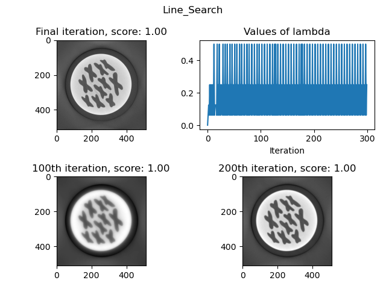

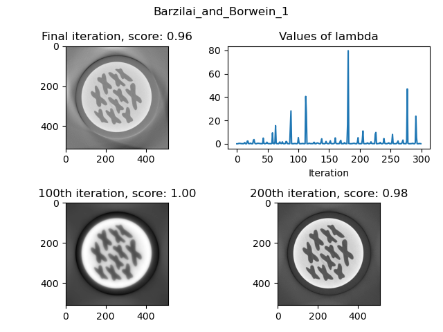

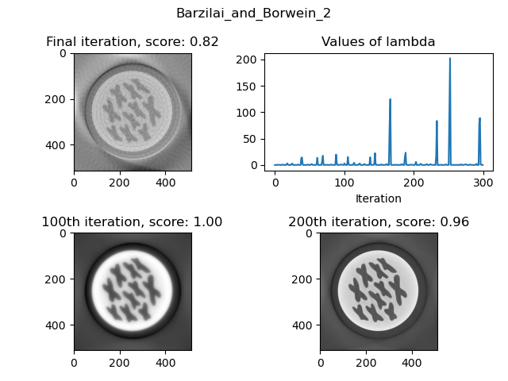

We can see that in the case of backtracking, the value of $\lambda$ has a stable, oscillating pattern, whereas BB1 and BB2 follow a similar pattern with occasional "spikes". Probably in the case of BB2 these "spikes" are too big for this problem and cause the algorithm to acutally go away from the solution on the long run.

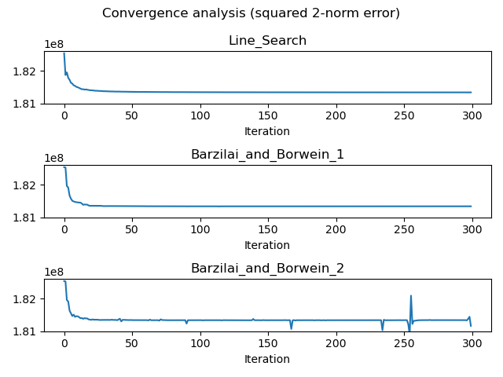

From this last plot, we can see that Backtracking is more stable, but decreases more slowly compared to BB1. BB2 also performs quite well, but it's more unstable.

### ii) Iterative Shrinkage-Thresholding Algorithm

For the creation of this algorithm, in the file `IterativeShrinkageThresholdingAlgorithm.py`, I followed the same structure as `GradientDescentClass.py` and compared the performance of the algorithm with a set $\beta=10^{-2}$. As we can see, a dynamic step size helps immensely and we observe a behaviour similar to the one in point i).

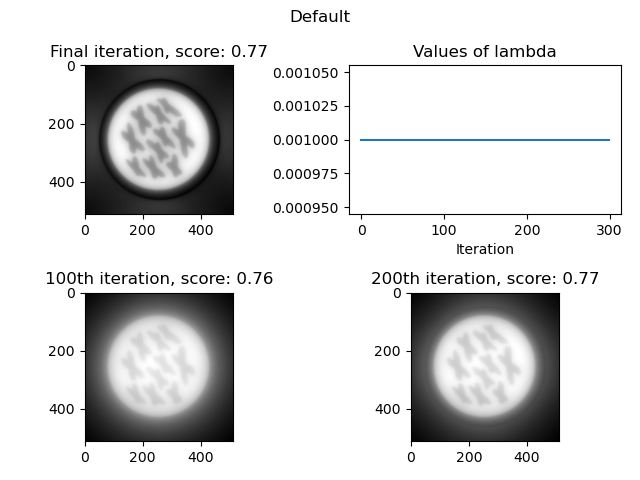

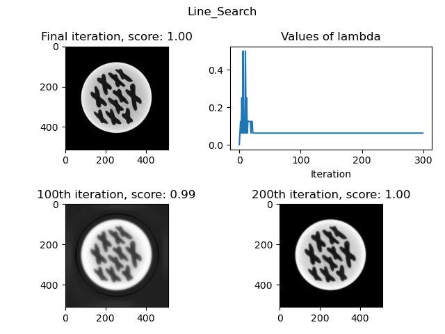

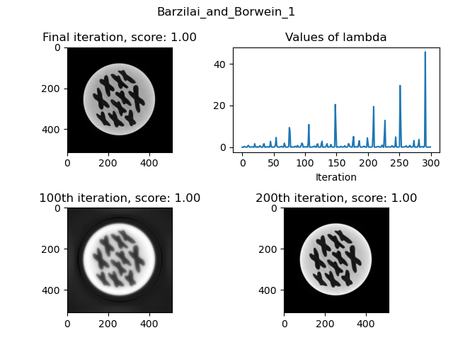

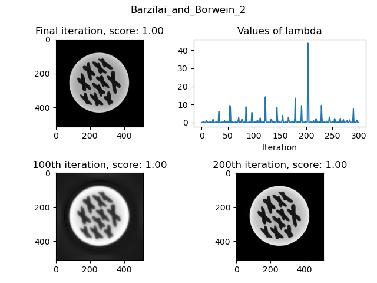

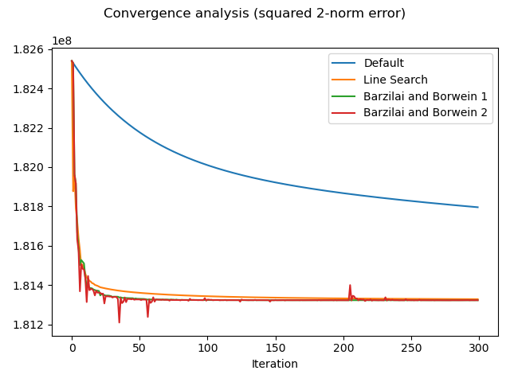

### iii) Projected Gradient Descent

## Part 2: Semi-Convergence

## Part 3: Challenge Dataset
