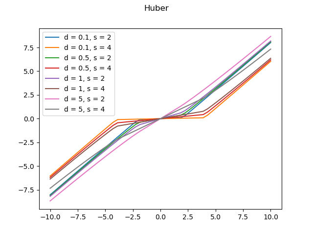

# Homework 5

## Part 1: Proximal operators

I decided to put all these proximal operators in a class, that only acts as a collection so that they don't get confused with their respective functions. The class is implemented in `ProximalOperators.py`.

Here are the plots of these operators in the interval $[-10, 10]$, with various values of sigma when applicable.

## Part 2: Proximal Gradient Method

### i) Proximal Gradient Method

### ii) Fast Proximal Gradient Method

### iii) Elastic Net Formulation

## Part 3: Restart Conditions
