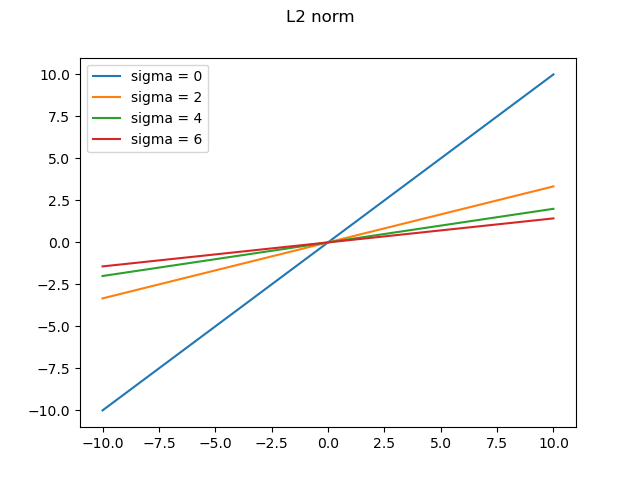

# Homework 5

## Part 1: Proximal operators

I decided to put all these proximal operators into a class, that acts as a collection so that they don't get confused with their respective functions. Furthermore, for generalization purposes the function should all have the same signature, even if they require different parameters. Therefore, I put the parameter setup in the class declaration to make the call of these functions easier. The class is implemented in `ProximalOperators.py`.

Here are the plots of these operators in the interval $[-10, 10]$, with various values of sigma when applicable.

## Part 2: Proximal Gradient Method

### i) Proximal Gradient Method

For this task, I took inspiration from `IterativeShrinkageThresholdingAlgorithm.py` and generalized it in `ProximalGradientMehod.py`.

Here are some results with different proximal operators, with the 07A phantom in full angle.

I tried to use line search, but the results aren't great. Same goes with BB1 and BB2.

The results don't seem great: I obtain an oscillatory behaviour while using BB1/BB2, and it doesn't converge well with backtracking. I tried different values of $\sigma$ without any significant improvement.

### ii) Fast Proximal Gradient Method

I decided to add this feature directly into the PGM class with two flags, `fast1` and `fast2`.

As we can see, it doesn't help much. This time, I didn't use any search for the value of $\lambda$.

### iii) Uniqueness of formulation

In the case of $g(x)=\frac{1}{2}||Ax-b||_2^2+\frac{\beta}{2}||x||_2^2$ and $h(x)=0$, we can work with the canonical gradient descent with Tikhonov regularization.

In the case of $g(x)=\frac{1}{2}||Ax-b||_2^2$ and $h(x)=\frac{\beta}{2}||x||_2^2$ instead, we can use PGM with the proximal operator of the L2 norm.

We can see that the PGM method converges quickly, but stalls after a short time, whereas GD converges more slowly but gets closer to the ground truth. The reason for the faster convergence might be the constant projection on our allowed space, but this is also probably the reason why the convergence stalls after a few iterations.

### iv) Elastic Net Formulation

In the case of the elatic-net formulation problem $f(x)=\frac{1}{2}||Ax-b||_2^2+\beta||x||_1+\frac{\tau}{2}||x||_2^2$, we can consider $g(x)=\frac{1}{2}||Ax-b||_2^2+\frac{\tau}{2}||x||_2^2$, i.e. the usual Tikhonov regularization problem, and $h(x)=\beta||x||_1$ as the proximal friendly part. For this purpose, I modify ISTA to accomodate also a Tikhonov problem. I also modified PGM to include this possibility out of the box, but I haven't implemented the L1 operator separately.

In this case, I tried with the phantom 07A and a 90° angle, with 100 iterations. The results are quite interesting.

## Part 3: Restart Conditions

For this experiment, I use the Shepp Logan phantom with Gaussian noise. After many tries, I have to say that I cannot find significant changes in any of the methods, as we can see in the following plots.

