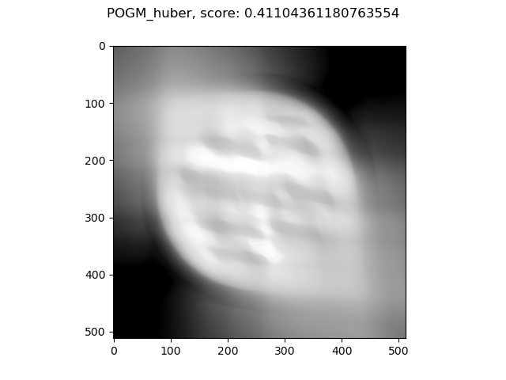

# Homework 6

## Part 1: Proximal Optimized Gradient Method

For this assignment, I build yet another class on the style of the previous ones, in  `ProximalOptimizedGradientMethod.py`. I had to modify the class in `ProximalOperators.py` in order to accomodate the varying $\sigma$ value required by the algorithm, and I implemented the non-negativity constraint on all the used methods. I make a comparison among OGM1, PGM and OGM, with varying parameters. I used BB1 (when applicable) and the results seem quite satisfying. I'm using the phantom 07A with a 90° angle.

I decided to plot directly the scores. As we can see, some algorithms "get stuck" more or less at the same level: OGM seems to reach the POGM level, but slowly.

Here are the final scores, side by side:

- OGM: 0.7632
- PGM, constant operator: 0.8281
- PGM, Huber operator: 0.4042
- PGM, L2 operator: 0.4165
- POGM, constant operator: **0.8581**
- POGM, Huber operator: 0.4110
- POGM, L2 operator: 0.7211

In bold the best score.

## Part 2: Expectation Maximization

## Part 3: Low Dose X-ray CT
