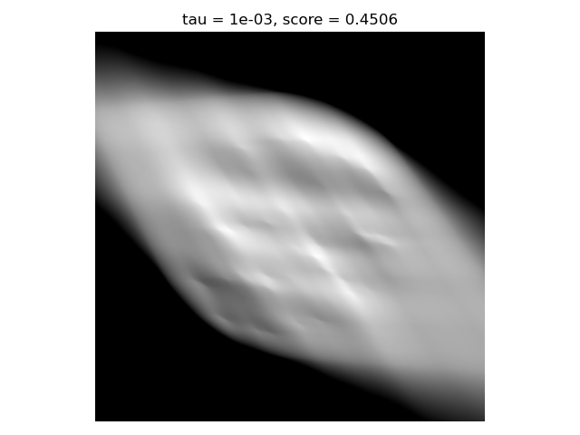
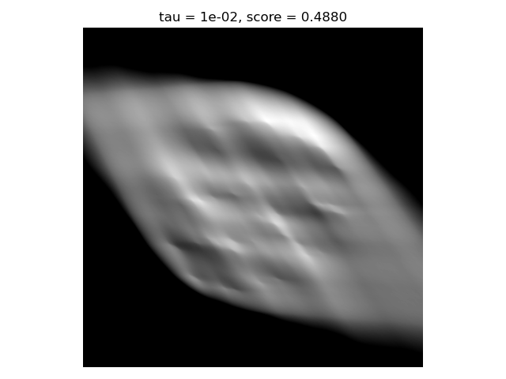
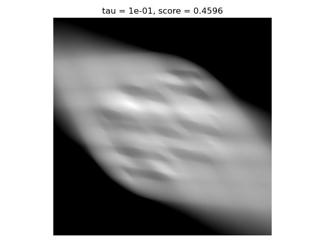
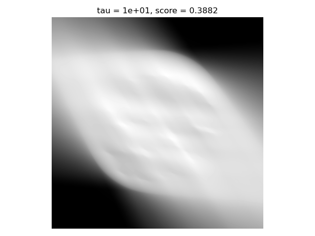
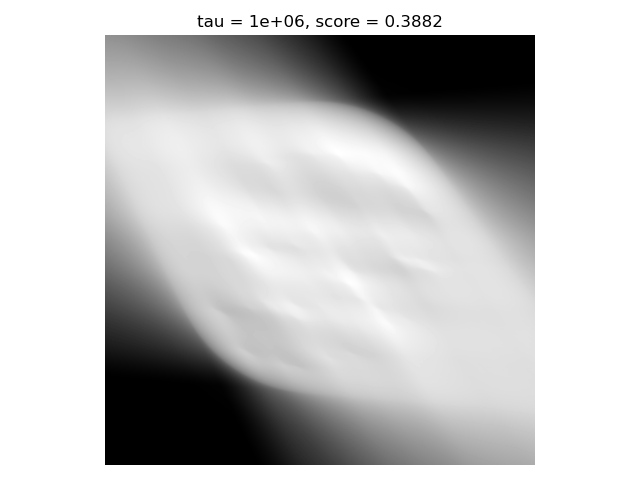

# Homework 7

## Part 1: More Proximal Operators

I add these two operators to `ProximalOperators.py`.

## Part 2: ADMM

I implement this algorithm in `LinearADMM.py`, with the usual layout of my other algorithms. I directly implement it with the XrayOperator in mind. I test it with phantom 7b and 60 degree angle.

### i) LASSO Problem

As we can see, there is basically no difference for different values of $\tau$, and the reconstruction isn't the best. These are the results after 100 iterations.

### ii) TV regularization

#### Stacked operators

I implemented this functionality in a class called `stack` inside `LinearADMM.py`, given that it will mostly be used there. I used the `.apply()` and `.applyAdjoint()` logic to be consistent with `XrayOperator` and `FirstDerivative`, which is implemented based on the *Appendix* in file `ForwardDifferences.py`.

#### Separable sum

I also implemented these two features directly inside `LinearADMM.py`, as two classes that take the list of functions and the input vector.

#### Reconstructions

The reconstructions I get aren't very good and oddly enough I tried with a lot of different parameter combinations and the algorithm seems super unsensitive to them, I get the exact same result every time.

##### Isotropic

##### Anisotropic

