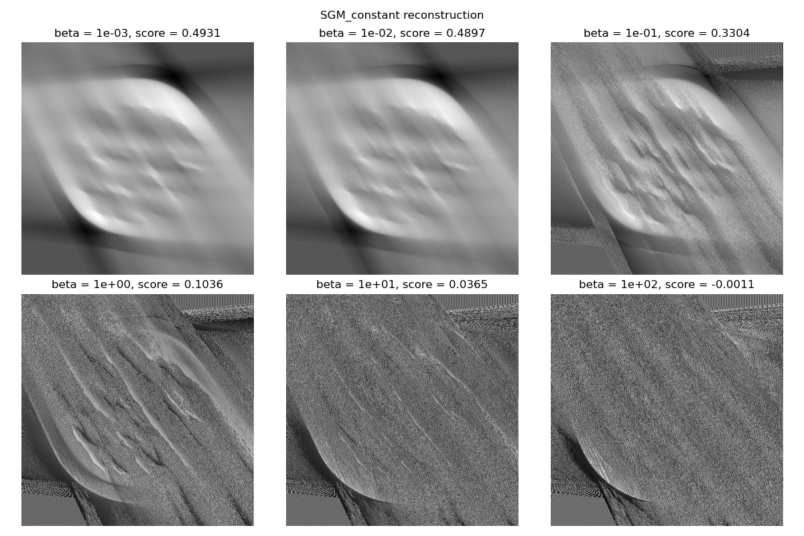
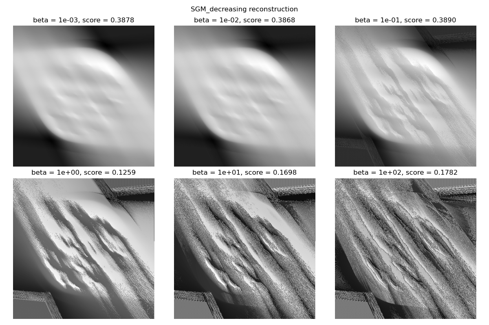
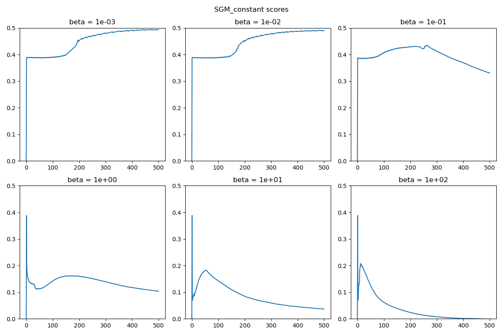
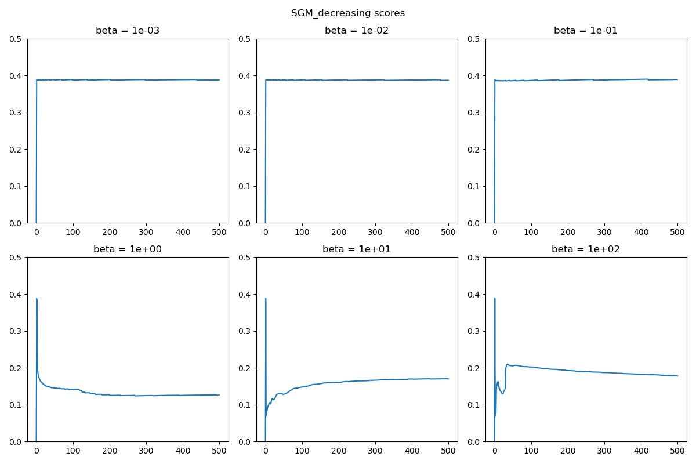
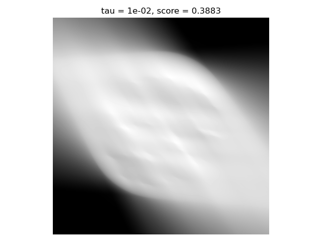
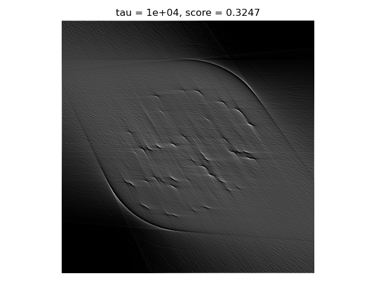
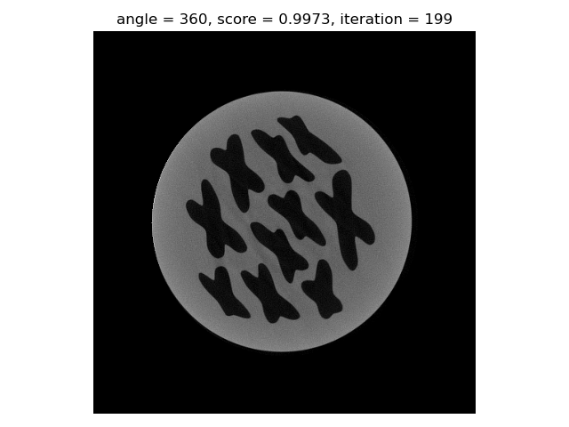
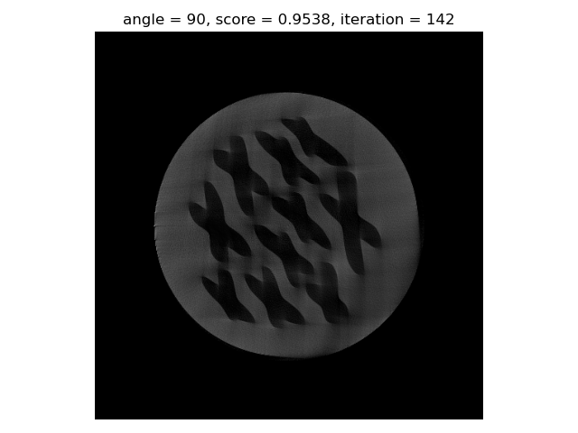
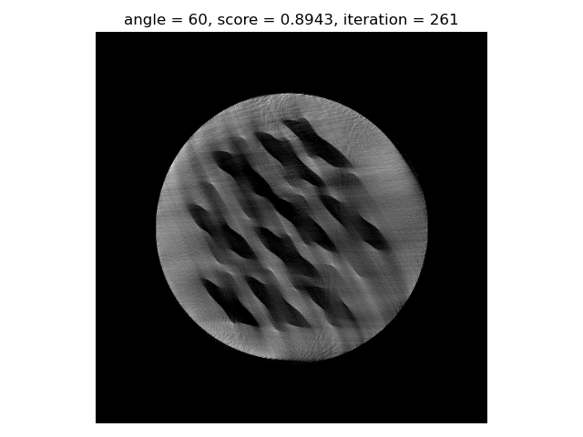
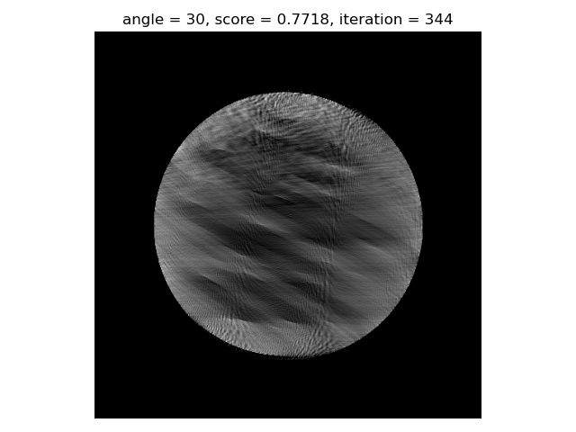

# Homework 8

## Part 1: Subgradient Method

I implement this method in `SubgradientMethod.py`, taking inspiration from my Gradient Descent class.

I tried with different $\beta$ values and with a constant or decreasing step size.

With a constant step size, the best $\beta$ value seems to be around $10^{-3}$ or $10^{-2}$.

With a decreasing step size we obtain a similar result, but the reconstruction is stuck at a score of approximately 0.38.

I now changed the ADMM implementation, given that I realized that I set the wrong values of the $\sigma$ parameter of the proximal operators. Now there is a visible difference sometimes, but score-wise the result is still far from optimal.

Here a couple of examples, with isotropic TV regularization:

## Part 2: Challenge

For this part, I concentrated on the ISTA algorithm, given that it's one of the best perfoming for me. I added to the normal fomulation (with BB2) the circular mask and the non negative constraint, given that I found out that they sensibly improve the score. I don't know if this can be considered cheating, but I tried with 1000 iterations at first and selected the image with the best score. I was also curious about after which iteration I reach the top score. These are the results:

| Angle | Score | Iteration |
|:-----:|:-----:|:---------:|
| 360 | 0.9973 | 199 |
| 90  | 0.9538 | 142 |
| 60  | 0.8943 | 261 |
| 30  | 0.7718 | 344 |

