# Final Presentation

## Helsinki Tomography Challenge

### Ground Truth

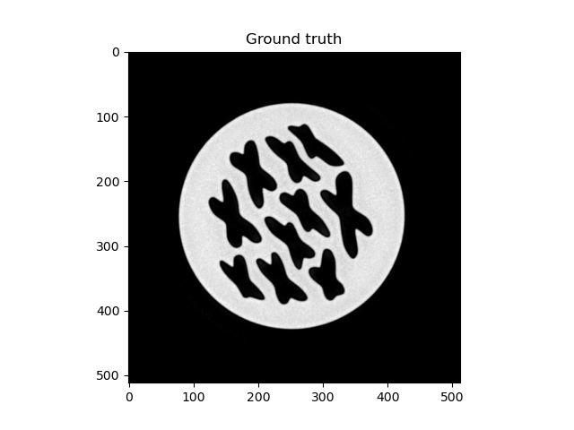

### Gradient Descent

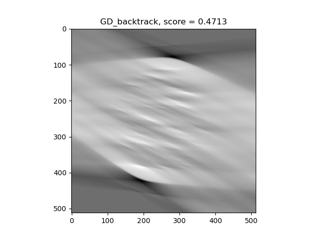

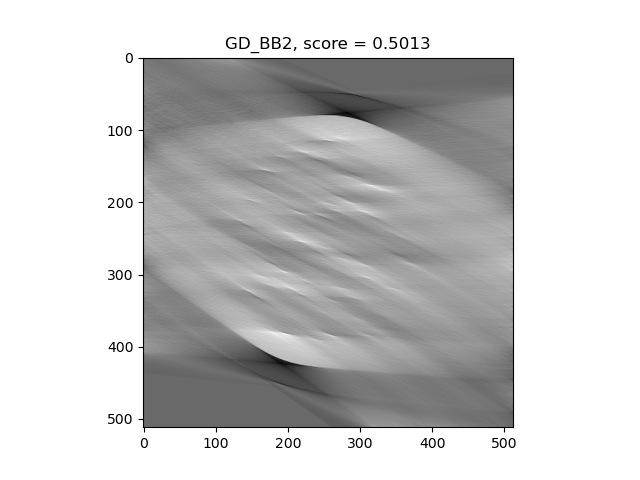

### Gradient Descent, circle fitting

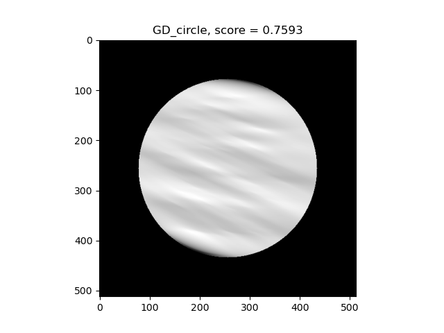

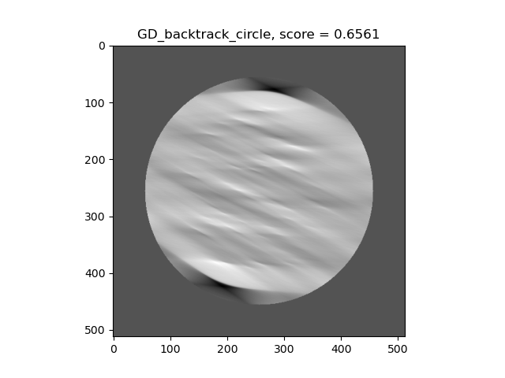

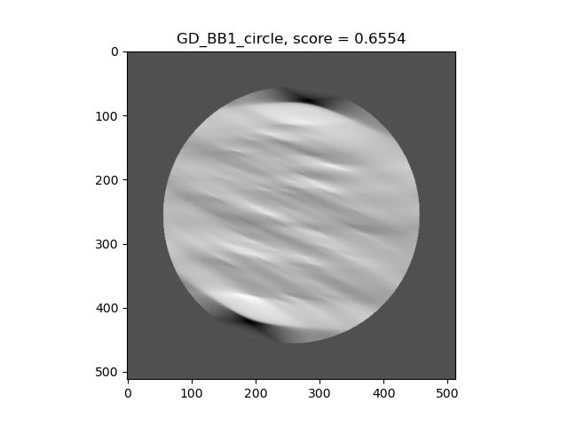

### Projected Gradient Descent (non negativity constraint)

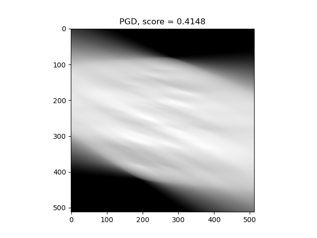

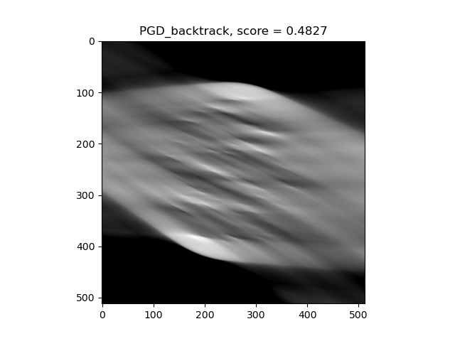

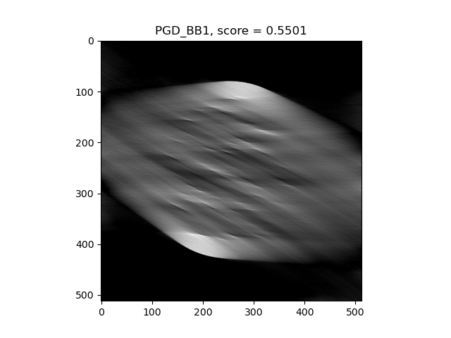

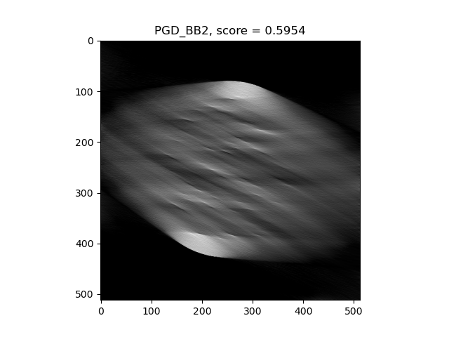

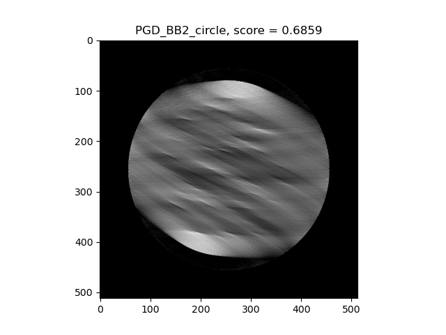

### Optimized Gradient Method

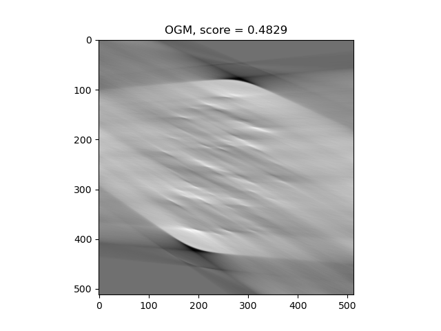

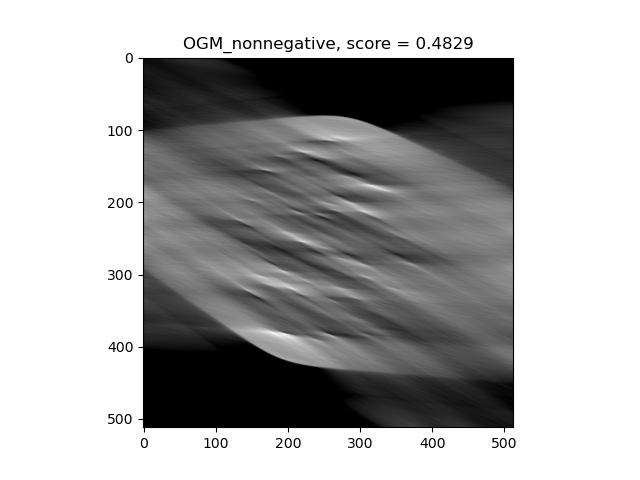

### Iterative Soft Thresholding Algorithm

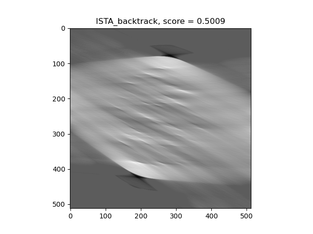

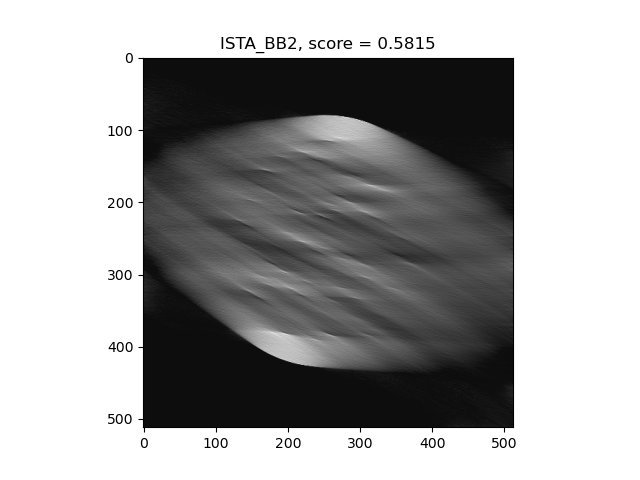

## Low Dose Dataset

### Ground Truth

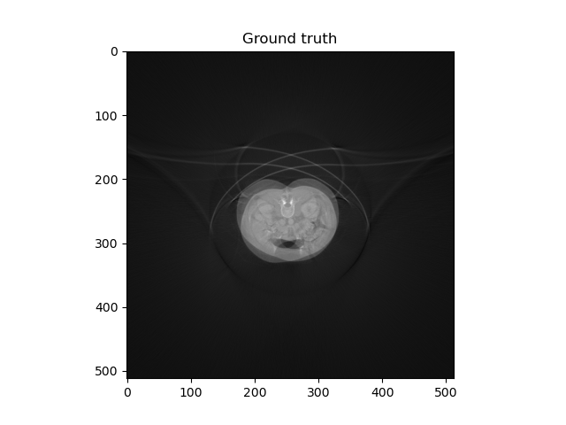

### Filtered Backprojection

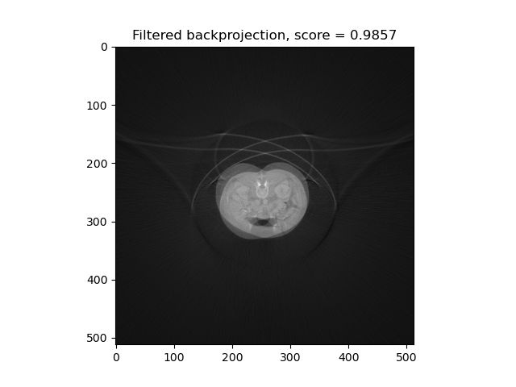

### Gradient Descent

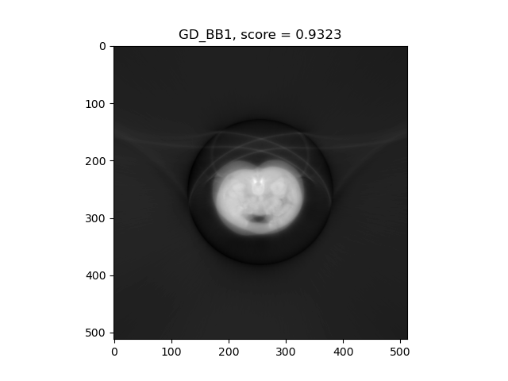

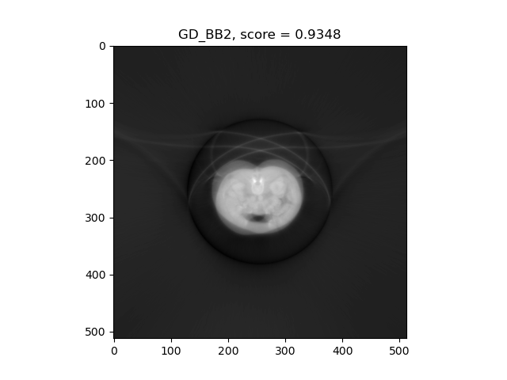

### Projected Gradient Descent (non negativity constraint)

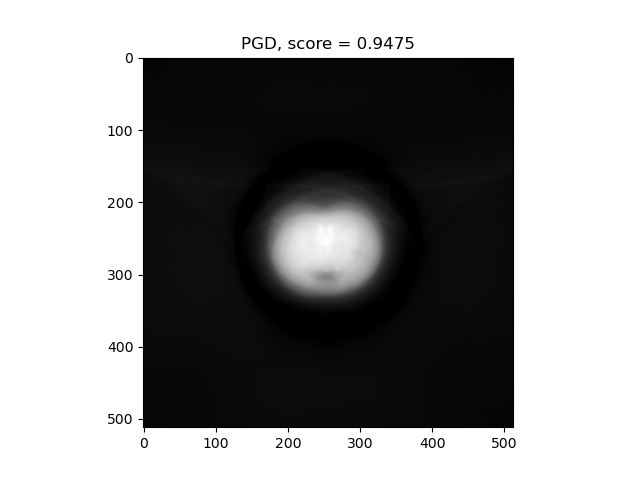

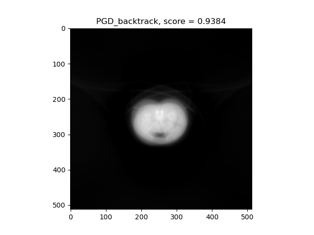

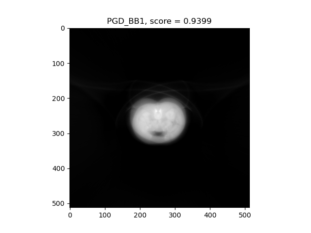

### Optimized Gradient Method

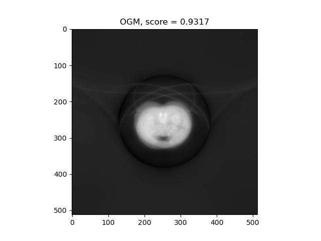

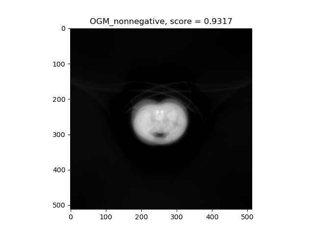

### Iterative Soft Thresholding Algorithm

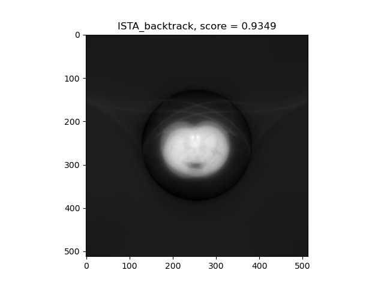

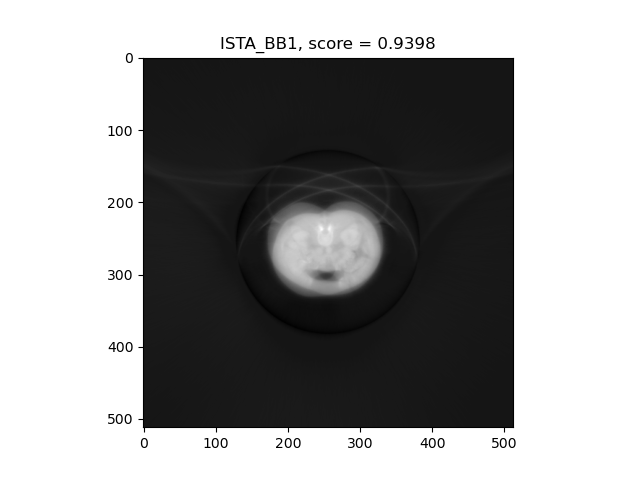

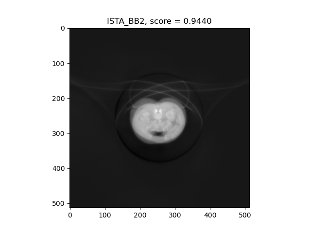
