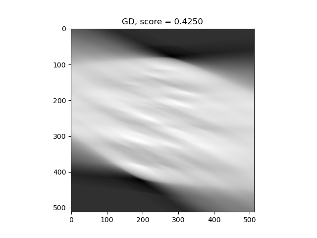
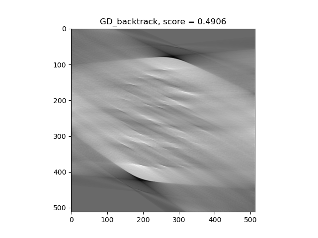
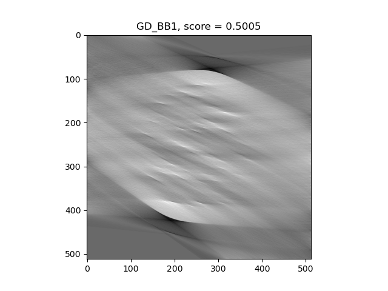
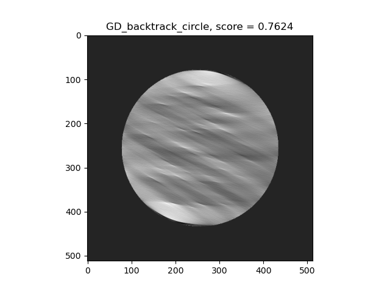
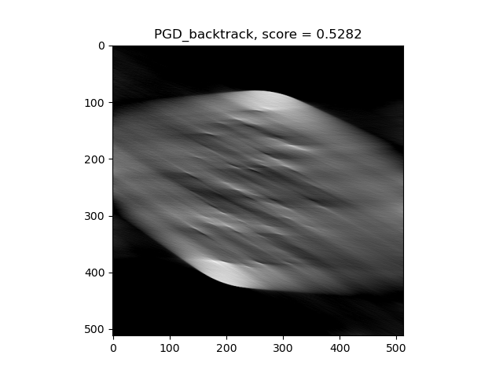
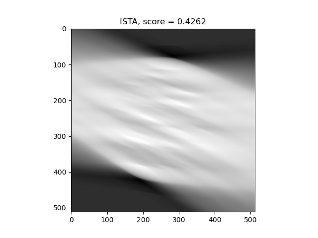
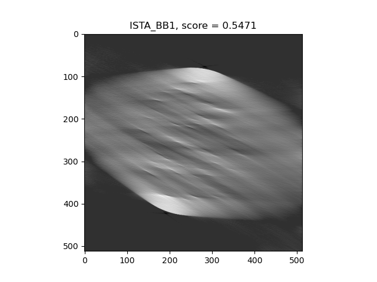

# Final Presentation

## Helsinki Tomography Challenge

### Ground Truth

### Gradient Descent

### Gradient Descent, circle fitting

### Projected Gradient Descent (non negativity constraint)

### Optimized Gradient Method

### Iterative Soft Thresholding Algorithm

## Low Dose Dataset

### Ground Truth

### Filtered Backprojection

### Gradient Descent

### Projected Gradient Descent (non negativity constraint)

### Optimized Gradient Method

### Iterative Soft Thresholding Algorithm

